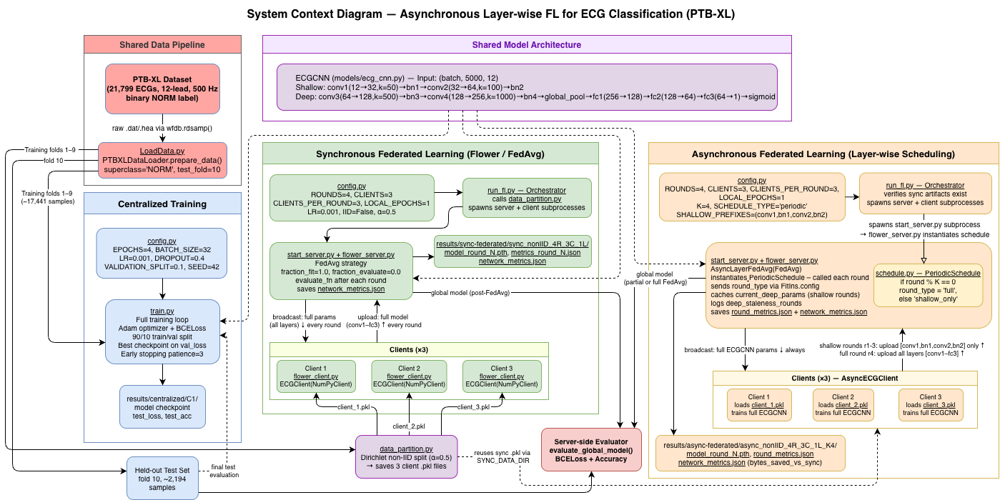

# Asynchronous Weight-Updating Federated Learning

Thesis: **A Study of Asynchronous Weight-Updating Federated Learning for IoT Health Devices**

---
## System Architecture



---

## The Foundation of Asynchronous Weight-Updating 

- **The CNN model is split into shallow and deep layers**: The global ECG CNN parameters $\boldsymbol{\theta}$ are partitioned into a shallow tensor $\boldsymbol{\theta}_S$ (early layers with prefixes matching `SHALLOW_PREFIXES`) and a deep tensor $\boldsymbol{\theta}_D$ (all remaining layers).
- **Clients always train the full model**: In each communication round $t$, every participating client $i \in \mathcal{P}_t$ runs local training on its private ECG data and updates both $\boldsymbol{\theta}_{S,i}^t$ and $\boldsymbol{\theta}_{D,i}^t$.
- **Server aggregates shallow layers every round**: The server performs a standard FedAvg-style aggregation of the shallow partition every round, so low-level ECG feature extractors stay well aligned across clients.

- **Deep layers synchronize only on selected rounds**: Deep layers are aggregated only in “full” rounds, every \(K\)-th round (\(t \bmod K = 0\)). In between, the server reuses a cached copy of the most recently aggregated deep parameters instead of collecting new deep updates.

- **Communication savings**: Uplink messages in shallow-only rounds contain only \(|\boldsymbol{\theta}_S|\) bytes instead of \(|\boldsymbol{\theta}_S| + |\boldsymbol{\theta}_D|\), reducing client \(\rightarrow\) server communication without changing the model architecture or the local training budget.

- **Server-side evaluation only**: After each round, the server evaluates the updated global model on a fixed held-out PTB-XL test set (shared with the centralized and synchronous baselines). No client-side evaluation is performed (\texttt{fraction\_evaluate=0.0}, \texttt{min\_evaluate\_clients=0}), so all utility curves are directly comparable across regimes.

---

## The Asynchronous Weight-Updating Formulation

We let $T \in \mathbb{N}$ be the total number of communication rounds and $K \in \mathbb{N}$ the deep-layer synchronization period. The model parameters are split as

$$
\boldsymbol{\theta} = (\boldsymbol{\theta}_S,\ \boldsymbol{\theta}_D)
$$

where $\boldsymbol{\theta}_S$ are the shallow parameters and $\boldsymbol{\theta}_D$ are the deep parameters. In round $t \in \{1, \dots, T\}$, the set of participating clients is $\mathcal{P}_t$. After local training, client $i$ holds $\boldsymbol{\theta}_{S,i}^t$ and $\boldsymbol{\theta}_{D,i}^t$, and the server computes FedAvg-style aggregates

$$
\text{Agg}_S^t = \sum_{i \in \mathcal{P}_t} w_i^t \boldsymbol{\theta}_{S,i}^t, \qquad
\text{Agg}_D^t = \sum_{i \in \mathcal{P}_t} w_i^t \boldsymbol{\theta}_{D,i}^t, \qquad
\sum_{i \in \mathcal{P}_t} w_i^t = 1
$$

The server maintains a deep-parameter cache $\widehat{\boldsymbol{\theta}}_D^t$. Under the `PeriodicSchedule`, the server update at round $t$ is

$$
\boldsymbol{\theta}_S^{t+1} = \text{Agg}_S^t
$$

$$
\boldsymbol{\theta}_D^{t+1} = \mathbb{I}[t \bmod K = 0]\ \text{Agg}_D^t + \left(1 - \mathbb{I}[t \bmod K = 0]\right) \widehat{\boldsymbol{\theta}}_D^t
$$

$$
\widehat{\boldsymbol{\theta}}_D^{t+1} = \mathbb{I}[t \bmod K = 0]\ \boldsymbol{\theta}_D^{t+1} + \left(1 - \mathbb{I}[t \bmod K = 0]\right) \widehat{\boldsymbol{\theta}}_D^t
$$

If $t \bmod K = 0$ (a *full round*), both shallow and deep partitions are freshly aggregated and the cache is refreshed. Otherwise (a *shallow-only round*), only $\boldsymbol{\theta}_S$ is updated from client uploads and the cached deep parameters are reused.

---

### Communication Cost

Let $|\boldsymbol{\theta}_S|$ and $|\boldsymbol{\theta}_D|$ be the byte sizes of the shallow and deep partitions.

The **uplink communication cost** in round $t$ is

$$
C_{\text{up}}(t) = |\mathcal{P}_t| \left( |\boldsymbol{\theta}_S| + |\boldsymbol{\theta}_D|\ \mathbb{I}[t \bmod K = 0] \right) \quad [\text{bytes}]
$$

The **downlink communication cost** is

$$
C_{\text{down}}(t) = |\mathcal{P}_t| \left( |\boldsymbol{\theta}_S| + |\boldsymbol{\theta}_D| \right) \quad [\text{bytes}]
$$

---

## Dataset (PTB-XL)

[PTB-XL](https://physionet.org/content/ptb-xl/1.0.3/) (PhysioNet): large public 12-lead ECG dataset.

- **Task**: Binary classification (e.g. NORM vs abnormal).
- **Splits**: Folds 1–9 train/val, fold 10 test (standard).
- **Signals**: 10 s, 500 Hz, 12 leads → (5000, 12) per recording.
- **Labels**: Diagnostic superclass (NORM, MI, STTC, CD, HYP). Data can be partitioned IID or non-IID across clients for FL.

---

## File structure

```
asynchronous-fl/
├── centralized/
│   ├── config.py              # Centralized data/model/training config
│   └── train.py               # Centralized ECG CNN training + logging
│
├── federated/
│   ├── synchronous/
│   │   ├── config.py          # FL config (clients, rounds, local epochs, IID/non-IID)
│   │   ├── data_partition.py  # IID and non-IID partitioning across clients
│   │   ├── flower_client.py   # Flower client: local training, parameter exchange
│   │   ├── flower_server.py   # FedAvg strategy, server eval, checkpoints, metrics, plots
│   │   ├── run_fl.py          # Orchestrator: prepare data, start server + clients
│   │   ├── start_server.py    # Launches synchronous Flower server
│   │   └── start_client.py    # Launches one synchronous client (--client-id)
│   │
│   └── asynchronous/
│       ├── README.md          # Async FL method description and usage
│       ├── config.py          # Async FL config; mirrors sync + async schedule knobs
│       ├── schedule.py        # Layer-wise update schedules (e.g., periodic shallow/deep)
│       ├── flower_server.py   # Async FedAvg with shallow/deep split, staleness + comm logs
│       ├── flower_client.py   # Async client; full local train, partial uploads per round type
│       ├── run_fl.py          # Orchestrator: validates sync artifacts, runs async server/clients
│       ├── start_server.py    # Launches async Flower server
│       └── start_client.py    # Launches one async client (--client-id)
│
├── models/
│   └── ecg_cnn.py             # Shared ECG CNN architecture for all regimes
│
├── PTB-XL/                    # PTB-XL dataset (or configure path via DATA_PATH)
│
├── results/
│   ├── README.md              # Description of saved metrics, logs, and plots
│   ├── centralized/           # Centralized training artifacts
│   ├── sync-federated/        # Synchronous FL artifacts (incl. shared partitions)
│   └── async-federated/       # Asynchronous FL artifacts
│
├── experiments/
│   ├── EXPERIMENT_MATRIX.md   # Full experimental matrix (regimes, ratios, bandwidth, IID/non-IID)
│   ├── EXP_A2.md              # Example async experiment spec/report
│   └── REPORT_TEMPLATE.md     # Template for writing experiment reports
│
├── Documents/                 # Thesis documents and progress reports
│
├── utils/
│   ├── tee_log.py             # Tee stdout/stderr to log file
│   └── ...                    # Process monitoring and convenience utilities
│
├── LoadData.py                # PTB-XL loader and fold-based splits
├── requirements.txt
├── .gitignore
└── README.md
```

Results are written to `results/centralized/`, `results/sync-federated/`, and `results/async-federated/` (checkpoints, metrics, plots, logs). Place PTB-XL under `PTB-XL/` at the project root or configure `DATA_PATH` in the configs.

---

## Experiments


| **Experiment**                                   | Update Cadence Policy           | Data Distribution | Client Participation Rate | Bandwidth Regime      | Shallow:Deep Update Ratio  | Controls (Held Constant)                                             |
|--------------------------------------------------|---------------------------------|-------------------|--------------------------|-----------------------|-----------------------------|----------------------------------------------------------------------|
| Centralized Training                             | N/A (Centralized SGD)           | IID / Non-IID     | Full (All)               | Unlimited             | N/A                         | Model, optimizer, batch size, init, splits, total epochs             |
| Synchronous Federated (FedAvg, baseline)         | Synchronous (FedAvg, K=1)       | IID / Non-IID     | Full / Partial           | Unlimited / Limited   | N/A                         | Model, data, per-client batch size, client config, random seed       |
| Async FedAvg (K=1, control sanity check)         | Async, K=1 periodic             | IID / Non-IID     | Full / Partial           | Unlimited / Limited   | Shallow:Deep = 1:1          | Model, data, optimizer, initial weights, partition set               |
| Async FedAvg (periodic shallow/deep schedule)    | Async, K>1 (periodic schedule)  | IID / Non-IID     | Full / Partial           | Unlimited / Limited   | 3:1, 5:1, (etc)             | Model, data, init, optimizer, partition set, synchronous server impl |
| Async FedAvg (participation+bandwidth ablations) | Async, various K + bandwidth    | IID / Non-IID     | Low vs High              | Low vs High           | 3:1, 5:1, (etc)             | Model, data, optimizer, seed, protocol as above                      |

**Legend:**  
- **Update Cadence Policy (Independent variable):** Frequency/differentiation of shallow vs. deep layer updates (periodic for async runs).  
- **Controls:** Model (ecg_cnn.py), partitions, random seed, training epochs, aggregation, evaluation pipeline.

---

### Dependent Variables (Experimental Outcomes Recorded)

For each experiment, we observe and record the following dependent variables:

**Primary Metrics (Communication/Synchronization Focus)**
- **Total bytes transmitted (system-wide)**
- **Bytes transmitted per client**
- **Number of parameter update messages**
- **Participation-adjusted communication cost**
- **Server-side waiting/straggler metrics (sync cost, async idle time)**
- **Shallow vs. deep parameter update frequency/staleness**

**Secondary Metrics (Model Utility and Stability)**
- **Model convergence (per round/epoch loss)**
- **Predictive performance (accuracy, F1, AUROC as appropriate)**
- **Variation/stability across seeds and experimental repetitions**

All metrics and configurations are logged per run under the appropriate `results/` subdirectory to ensure reproducibility and enable direct controlled comparison for evaluating asynchronous FL methods against baselines.


---

## Author

**Thomas Llamzon** – Honours Specialization in Computer Science, Western University
